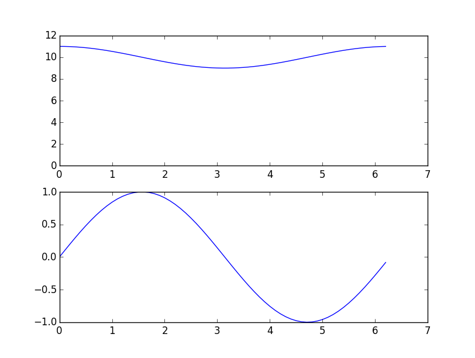

Dynamics
--------

Here we introduce the mathematics behind the calculation of the timing of the
led generated patterns: in order to calculate the timing we will using an
accelerometer; other systems(?) use a magnetic sensor to know the device
position and velocity but we don't like this solution since need to have a
magnet hanging on the bike itself.

Let :math:`\omega` be the angular velocity of the wheel, and :math:`R` the
external radius of the wheel and :math:`r` the distance from the center of
the wheel and the accelerometer, we have that the velocity of the wheel is given by

.. math::

   V = \omega R

using our test wheel at a velocity of
:math:`V = 18 km/h = {1.8\cdot 10^{4}\over 3600} m/s=5 m/s`
(using the average speed as indicated by `Wikipedia <https://en.wikipedia.org/wiki/Bicycle_performance#Typical_speeds>`_)
we obtain

.. math::

   \omega = {5 m/s\over 330\cdot 10^{-3}m} = 15.15 rad\cdot s^{-1} \qquad\hbox{i.e.}\quad
   f = {\omega\over 2\pi} = 2.41Hz

Since the centrifugal acceleration is

.. math::

   a = \omega^2\cdot r

we have that our test acceleration is

.. math::

   a = \left(15.15\cdot s^{-1}\right)^2\cdot 333\cdot 10^{-3} m = 76.43 m/s^2 \approx 8g

We need to know the angular velocity of the wheel in order to fit the timing
of the leds for the pattern to be displayed.

The accelerometer is moving together with the wheel and it's so placed in a not inertial
frame, experiencing a costant fictious acceleration along a fixed axes :math:`A` (we call the
axis :math:`A` and :math:`B` to avoid confusion with existing axis in the real device) and
a rotating acceleration with angular velocity :math:`\omega` and fixed magnitude :math:`g`.

When the accelerometer is at angle :math:`\theta` with respect to the vertical the
accelerations measured are

.. math::

    \begin{align}
    a_A &= a_0 + g\cdot\sin \theta\cr
    a_B &= g\cdot\cos\theta\cr
    \end{align}

.. image:: vectors.png
   :align: center

This allows us to calculate the accelerometer angular position from the second equation,
using it in the first to retrieve the angular acceleration and finally compute the angular
velocity (actually the angular position is determined knowning if also the slope of variation
of acceleration otherwise there are two solutions). 

An accelerometer will show reading like this

