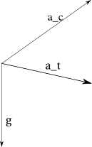

Dynamics
--------

Here we introduce the mathematics behind the calculation of the timing of the
led generated patterns: in order to calculate the timing we will using an
accelerometer; other systems(?) use a magnetic sensor to know the device
position and velocity but we don't like this solution since need to have a
magnet hanging on the bike itself.

In our solution we used the IC named ``MMA3202KEG``, that has two axis
with 100g and 50g of resolution. It's a linear accelerometer.

Let :math:`\omega` be the angular velocity of the wheel, and :math:`R` the
external radius of the wheel and :math:`r` the distance from the center of
the wheel and the accelerometer, we have that the velocity of the wheel is given by

.. math::

   V = \omega R

using our test wheel at a velocity of
:math:`V = 18 km/h = {1.8\cdot 10^{4}\over 3600} m/s=5 m/s`
(using the average speed as indicated by `Wikipedia <https://en.wikipedia.org/wiki/Bicycle_performance#Typical_speeds>`_)
we obtain

.. math::

   \omega = {5 m/s\over 330\cdot 10^{-3}m} = 15.15 rad\cdot s^{-1} \qquad\hbox{i.e.}\quad
   f = {\omega\over 2\pi} = 2.41Hz

Since the centrifugal acceleration is

.. math::

   a = \omega^2\cdot r

we have that our test acceleration is

.. math::

   a = \left(15.15\cdot s^{-1}\right)^2\cdot 333\cdot 10^{-3} m = 76.43 m/s^2 \approx 8g

We need to know the angular velocity of the wheel in order to fit the timing
of the leds for the pattern to be displayed.

The problem is that the resulting vector (measured by the sensor) is given by the vectorial sum
of the usual gravity and the centrifugal force

.. math::

   \vec{a}_t = \vec{g} + \vec{a}_c

Since from the sensor we obtain only the resulting vector we are missing also the
angle between :math:`\vec{a}_t` and :math:`\vec{g}`; to avoid the calculation at given time
we interpolate using the instants where the acceleration has its maximum and minimum:
in the first case the sensor is in the lowest position (so that gravity and centrifugal
acceleration sum up) and the last case is when the sensor is at the highest position.

An accelerometer will show reading like this
