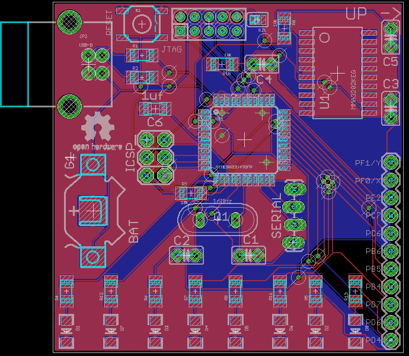

The ``SJ1`` is a solder-jump that decides which chips  must be powered: the central
pad is the power supply, the left pad is connected to the ``VCC`` of the ``ATMega32U4``
and the right one is connected to the ``VCC`` of the accelerometer. In this way is possible
to test separately these two ICs.

## TODO

 - calculate energy consumption
 - calculate theoretically operations timing (is it possible to read from ADC and displaying a picture reliably?)
 - expose pin for external generic power supply (connect them to the battery so we save some diodes)
 - expose pins like ``GND`` and ``VCC``
 - add mounting holes
 - increase traces width for VCC
 - add ``BOOT`` button
 - AVCC must be connected to VCC through a low-pass filter
