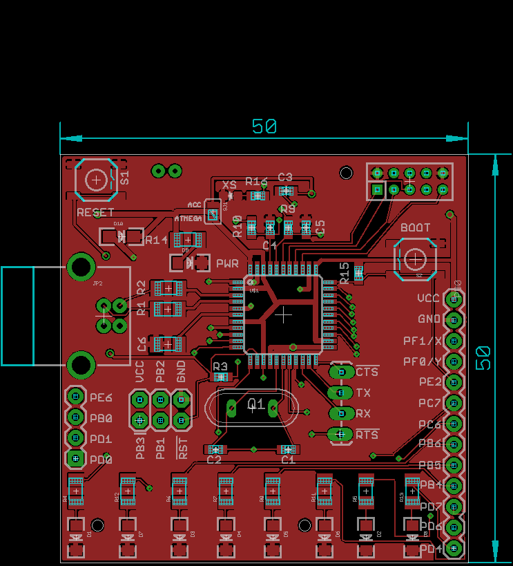
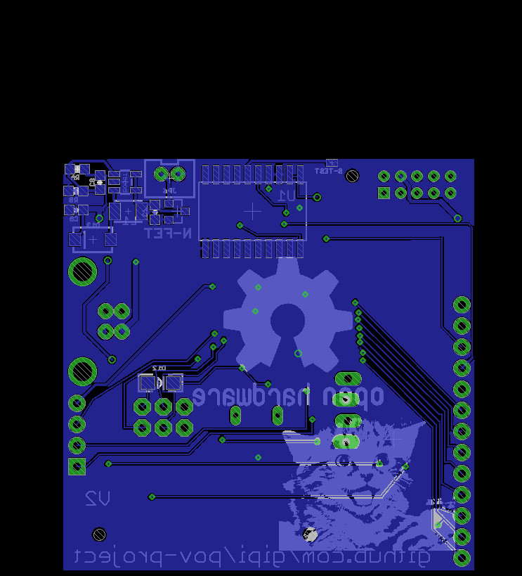

The ``SJ1`` is a solder-jump that decides which chips  must be powered: the central
pad is the power supply, the left pad is connected to the ``VCC`` of the ``ATMega32U4``
and the right one is connected to the ``VCC`` of the accelerometer. In this way is possible
to test separately these two ICs.

## TODO

 - differentiate power supply between USB and battery (maybe use opamp like arduino boards do)
 - use less power consuming accelerometer (MPU-9255)
 - use sensor that gives absolute angular position
 - calculate energy consumption and minimize it
 - calculate theoretically operations timing (is it possible to read from ADC and displaying a picture reliably?)
 - expose pin for external generic power supply (connect them to the battery so we save some diodes)
 - separate pins for ``SPI``, ``I2C``, ``USART`` with power pins near for each of them in order to facilitate coupling with related devices
 - AVCC must be connected to VCC through a low-pass filter

