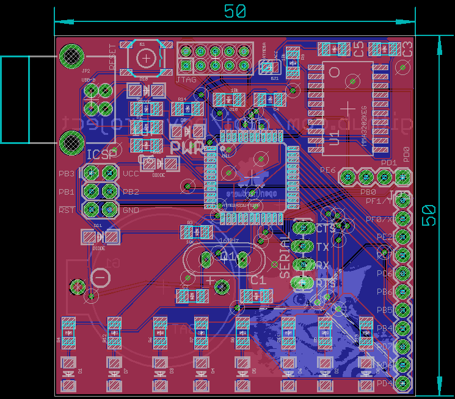

## TODO

 - calculate energy consumption
 - calculate theoretically operations timing (is it possible to read from ADC and displaying a picture reliably?)
 - add power led indicator
 - expose pin for external generic power supply (connect them to the battery so we save some diodes)
 - expose pins like ``GND`` and ``VCC``
 - add mounting holes
